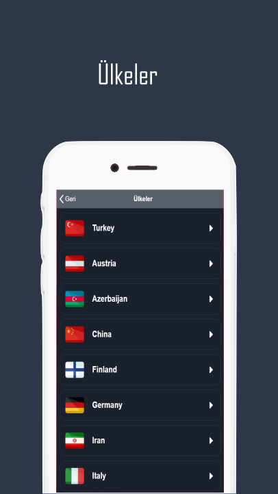
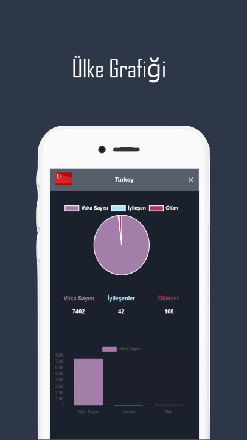

# CoronaEp-Covid-19
 

 <h3>
  <a href="https://ionicframework.com/">Ionic</a> 5 ile Covid-19 salgınını takip etmek için geliştirdiğim ufak bir uygulama.
 </h3>
  <h3>
   I have developed a small app with <a href="https://ionicframework.com/">Ionic</a> 5 to track Covid-19 pandemic
 </h3>

 
<ul>
 <li>
  

  Apk'yi indirmek isterseniz: <a href="https://github.com/Alan4747/CoronaEp-Covid-19/blob/master/coronaEp.apk">coronaEp.apk</a>
  

 </li>
  <li>
  

  If you want to download the Apk: <a href="https://github.com/Alan4747/CoronaEp-Covid-19/blob/master/coronaEp.apk">coronaEp.apk</a>
  

 </li>
</ul>
  

 
 

